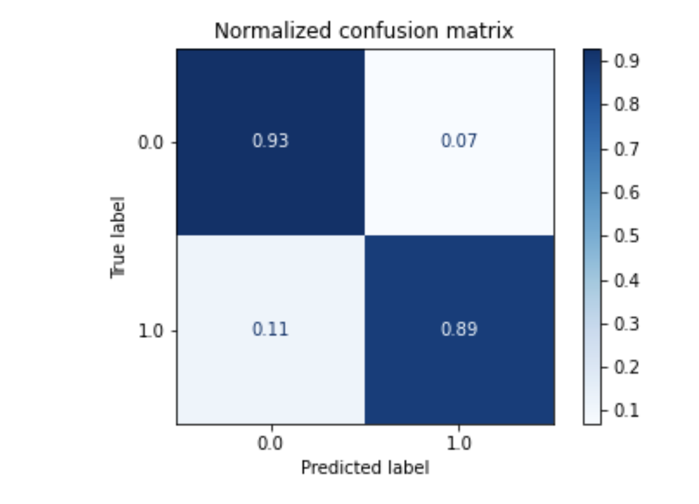
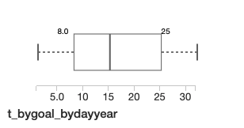
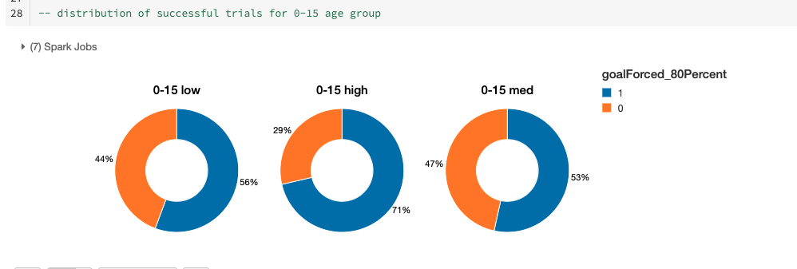
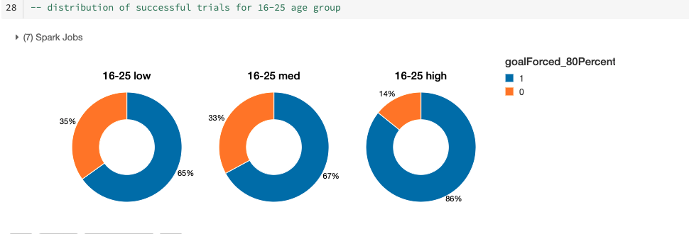

# Use Case 3 - Application of Machine Learning to ABA Data

This use case analyzes anonymized therapy data from a repository of Applied Behavior Analysis sessions and cases to draw insights which can be used by individual families to help understand the effectiveness of their programs. 

## Technologies Used

### Languages

1. Python
2. SQL

### Platforms

1. Azure Databricks

### Libraries Used

1. sklearn
2. matplotlib
3. pandas
4. numpy
5. databricks MLFlow

## Deliverables Covered

1. Evaluation of 80% as a set goal for indication of future successes
2. Evaluation of the effect of treatment intensity on trial outcome
3. Analysis on the correlation of therapist/author based descriptors with outcomes

## Data Overview

## Part-2: Evaluation of the effect of treatment intensity on trial outcome

### Data Cleaning and Pre-processing

1. Missing values are marked as 0
2. Conversion of string columns to datetime for fields containing 'Date'
3. Conversion of categorical fields to encoded ones using Pandas Label Encoding

### Initial Data Analysis

### Feature Engineering

1. **sessionCount_byGoal_byMonthYear** : Count of sessions graphed (TrialGroup) per month per year 
2. **sessionCount_byGoal_byDayYear** : Count of sessions graphed (TrialGroup) per day per year 
3. **sessionCount_byGoal_byWeekYear** : Count of sessions graphed (TrialGroup) per week per year
4. **Gender_Encoded** : Demographic Data
5. **Age** : Demographic Data, calculated with the difference of TrialDataDate and BirthDateYear
6. **TrialTargetId_Encoded** : IDs of the target Goals
7. **GoalDomain_Encoded** : Encoded goal domain value of Adaptive, Communication and Language
8. **goalAssessment_encoded** : Encoded goal ABA assessment
9. **encodedTrialPhase** : Encoded Trial Phase (Baseline' -1,'Intervention' -2,'Generalization' -3,'Maintenance'-4)
10. **goalForced_80Percent** : The target value of outcome to 80% set goal

### Models Used

1. Random Forest
2. Decision Tree

### Feature Importance

### Confusion Matrix

### ROC Curve

### Inferences

1. The initial data analysis shows that the session count descriptors of days and weeks have a negative correlation with the goalForced_80Percent outcome, which can be interpreted as less number of sessions or more spread out sessions increase the chances of a successful outcome whereas a high number of sessions might lead to an unsuccessful outcome.

2. The feature importance from the Supervised Models show that Session Count/ Treatment Intensity descriptors
are more useful in predicting a successful outcome than the demographic features that implies that the treatment intensity/ frequency plays a more important role in the result of an outcome when compared to the gender or age of the client.

3. The Goal ID is also a useful feature but has limitations due to high cardinality which implies that if the goals are restricted or categorized, then they will be important in determining the outcome but if they aren't categorical, they might not be a suitable feature for the Machine Learning models due to their high cardinality.

4. Age is a more useful predictor for the outcome of a trial than the goal domain or trial phase which implies that the age of the clients is a contributing factor to the success outcome of the goal.

### Multiple therapist changes decreases success rates

## Part-3: Evaluation of graphing intensity for different age groups

### Involvement of different age groups in the trials
1. Younger clients are more involved in the trials than the older ones. 
2. Age group from 7-15 is the most active in the trials.

### Determination of graphing intensity
This analysis is done on the basis of distribution of number of observations taken for a trial on a day.

The median number of observations taken is 15. Based on the above distribution, the intensity is chunked into 3 categories:   
    1. sessioncount_bygoal_bydayyear between 8 and below --> low intensity  
    2. sessioncount_bygoal_bydayyear between 8 and 25 --> medium intensity  
    3. sessioncount_bygoal_bydayyear between 25 and above --> high intensity  

Further analysis is done on the basis of age groups. 

### Age group wise distribution of un/successful trials based on graphing intensity
Age groups are divided into 3 categories:   
    1. 0-15   
    2. 15-25   
    3. 25 and above   

Based on the above categories, further analysis is done for understanding how the graphing intensity affects the success of the trials.

#### Inference:
For 0-15 age group, the success of the trials is higher for higher intensity graphing method while for low and medium intensity, the success rate is only slightly higher than unsuccessful trials

#### Inference:
For 16-25 age group, most of the clients are faring well in all the categories of graphing intensity with a good success rate. It must be highlighted that the high intensity graphing method is helping perform the best among the others.

#### Inference:
For 26 and above age group, more than 50% of the clients are performing well in all the 3 categories of the graphing intesity. But the graphing intensity is not much helpful in considering which method is best for this age group. 

### Conclusion
Higher intensity graphing method showed better results for the age groups between 0-15 and 16-25 but the graphing intensity did not affect much for the success of the trials for the older age group (26 and above)
